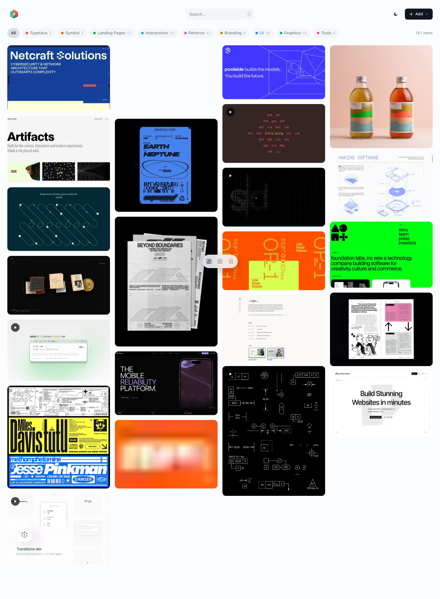
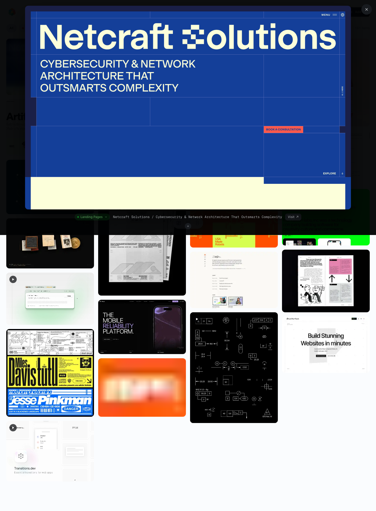
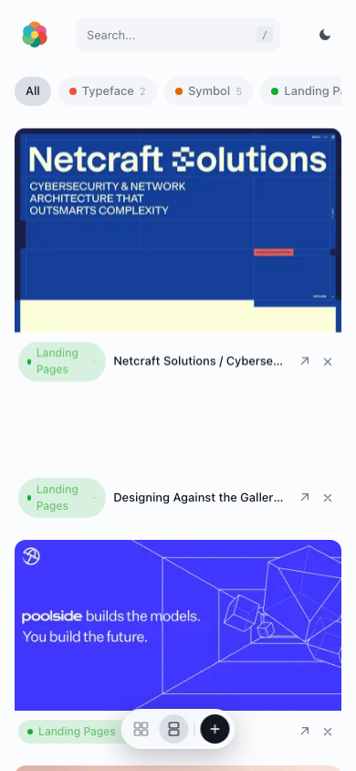
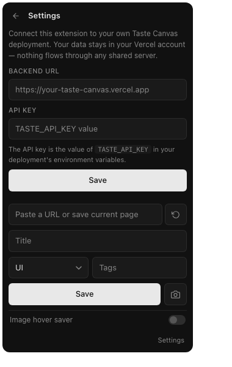

# Taste Canvas

A self-hosted visual reference board for design inspiration — typefaces, landing pages, UI, branding, color palettes. Save images, capture URLs, organize by category. Your data lives in your own Vercel account.

**[→ taste-canvas-landing.vercel.app](https://taste-canvas-landing.vercel.app)** — landing page, examples, and one-click deploy.


## Why

Pinboard apps and bookmark managers are centralized. Your visual references end up locked in someone else's database — sold, mined, or eventually shut down. Taste Canvas is the inverse: deploy your own copy and every image you save lives in **your** Vercel Blob store, behind **your** auth key, in **your** account. Forks don't share data.

## Screenshots

The board with masonry layout, category filters, and search:



Lightbox with full-resolution preview:



Mobile / PWA — installable to the home screen, with camera capture for IRL references:



Companion Chrome extension popup — point it at your own deployment via the Settings panel, then save links/images/videos with one click or `Alt+Shift+S`:



## Features

- Save images by upload, URL screenshot, or pasted tweet URL
- Categorize by type (typeface, UI, landing pages, branding, color palette, etc.)
- Tag and search
- Masonry, grid, and feed layouts
- Lightbox viewer with full-resolution preload
- LQIP blur placeholders + WebP thumbnails (Sharp)
- Optional Chrome extension for one-click saving from any page
- Optional PWA install for mobile camera capture IRL

## Stack

React 19 · Vite 8 · TypeScript · Tailwind v4 · Framer Motion · Vercel Blob · Sharp · puppeteer-core + @sparticuz/chromium

## Quick start: deploy to Vercel

[](https://vercel.com/new/clone?repository-url=https%3A%2F%2Fgithub.com%2Fspoony-vu%2Ftaste-canvas&project-name=taste-canvas&repository-name=taste-canvas&stores=%5B%7B%22type%22%3A%22blob%22%7D%5D&env=TASTE_API_KEY&envDescription=TASTE_API_KEY%20is%20any%20random%20string%20%28openssl%20rand%20-hex%2032%29.&envLink=https%3A%2F%2Fgithub.com%2Fspoony-vu%2Ftaste-canvas%23environment-variables)

The button above will:

1. Clone this repo into your GitHub account
2. Create a new Vercel project linked to it
3. **Auto-provision a Vercel Blob store** (this is where your images and manifest will live — only you can read/write it)
4. Prompt you for `TASTE_API_KEY`
5. Deploy

After deploy, visit your site URL and start saving images. There is no signup, no shared backend, and no telemetry.

## Environment variables

| Name | Required | What |
|------|----------|------|
| `BLOB_READ_WRITE_TOKEN` | yes | Auto-set by the Vercel Blob integration. Don't set manually. |
| `TASTE_API_KEY` | yes (in prod) | Bearer token used by the browser extension and any external script. Generate with `openssl rand -hex 32`. The frontend uses same-origin auth, so it doesn't need to know this value. |
| `VITE_PUBLIC_URL` | optional | Your deployed origin (`https://your-app.vercel.app`). Used for absolute social preview URLs when set; local builds fall back to `/og.png`. |

Copy `.env.example` to `.env.local` for local dev, and set the same variables in **Vercel → your project → Settings → Environment Variables** for production.

## Local development

```bash
git clone https://github.com/spoony-vu/taste-canvas.git
cd taste-canvas
npm install

# Connect to your Vercel project to pull the Blob token automatically:
npx vercel link
npx vercel env pull .env.local

# Or copy .env.example and fill in by hand
# cp .env.example .env.local

npm run dev
```

This starts Vite on `http://localhost:5173` and a thin API adapter on `:3002`. Vite proxies `/api` to the adapter, which mounts the same `api/*.ts` handlers Vercel deploys in production — single source of truth, no drift.

## Verify

```bash
npm run lint
npm run build
npm test
npm run test:smoke
```

`npm run build` is the same typechecked command Vercel runs. `npm test` runs API/helper characterization tests with Vitest. `npm run test:smoke` starts an isolated local dev server on ports `5174` and `3102`, then runs a Chromium smoke test with Playwright.

## Architecture

- **`api/*.ts`** — Vercel serverless functions. The only backend code in the project.
- **`server/dev.ts`** — Local Express adapter that mounts `api/*.ts` handlers. Zero logic of its own.
- **`api/_storage.ts`** — Shared Blob helpers (`readManifest`, `writeManifest`, `uploadImageWithThumb`, etc.) used by every handler.
- **`api/_auth.ts`** — Bearer-token + same-origin auth. Both paths are required: same-origin for the browser frontend, Bearer for the extension and any scripts.
- **`src/`** — React frontend. State lives in `useManifest` hook (single source of truth on the client).

## Runtime support

- Node.js `>=22.12 <26`
- npm `>=10`
- Browser floor: Chrome/Edge 120+, Firefox 121+, Safari 17+

## Browser extension

A companion Chrome extension lets you save any image, video, link, or page screenshot to your taste canvas with one click, a hover button, or a keyboard shortcut. It reads your backend URL + API key from its own Settings panel — each fork uses its own deployment, with no shared server.

Repo: **[spoony-vu/taste-canvas-extension](https://github.com/spoony-vu/taste-canvas-extension)**.

### Install (unpacked, ~1 minute)

The extension is unpublished on the Chrome Web Store — install from source:

1. **Clone it**
   ```bash
   git clone https://github.com/spoony-vu/taste-canvas-extension.git
   ```
2. **Load in Chrome** (or any Chromium browser — Edge, Brave, Arc):
   - Open `chrome://extensions`
   - Toggle **Developer mode** on (top-right)
   - Click **Load unpacked** and select the cloned directory
3. **Connect to your backend** — click the extension icon in the toolbar, then in the Settings panel:
   - **Backend URL** — your deployed origin (e.g. `https://your-taste-canvas.vercel.app`)
   - **API key** — your `TASTE_API_KEY` (see below for how to find or generate it)
   - Click **Save** — Chrome will prompt to grant access to your backend's host. Approve.
4. **Done.** Right-click any image/video/link → "Save to Taste Canvas". Or hover an image → click the floating "+". Or hit `Alt+Shift+S` to save the current page.

The extension verifies the URL + key by hitting `/api/manifest` before saving anything. If you change `TASTE_API_KEY`, update it in Settings.

### Where do I get the `TASTE_API_KEY`?

This is the same value you set as a Vercel environment variable when deploying. Three scenarios:

**You set it during the Deploy-to-Vercel flow** (most common):
1. Go to [vercel.com/dashboard](https://vercel.com/dashboard) → your `taste-canvas` project
2. **Settings → Environment Variables**
3. Find `TASTE_API_KEY` → click the eye icon to reveal → copy the value
4. Paste into the extension's Settings → **Save**

**You forgot to set it** (production write endpoints fail closed until you do):
1. Generate one: `openssl rand -hex 32` (any random ~32+ character string works)
2. In Vercel → Settings → Environment Variables → **Add New** → name `TASTE_API_KEY`, paste value, select all environments → **Save**
3. **Redeploy** so the new variable takes effect (Deployments tab → latest → ⋯ → Redeploy)
4. Paste the same value into the extension

**You want to rotate it** (compromised, lost, just paranoid):
1. Generate a new value with `openssl rand -hex 32`
2. Update `TASTE_API_KEY` in Vercel → redeploy
3. Update the extension's Settings panel with the new value
4. Old key stops working immediately on the next deploy

## Mobile / PWA

Taste Canvas installs as a Progressive Web App on iOS and Android, with full-screen standalone display and a custom home-screen icon.

**iOS:** open the deployed URL in Safari → Share → **Add to Home Screen**.
**Android:** open in Chrome → menu → **Install app** (or **Add to Home screen**).

Once installed, the camera button in the add menu opens the device camera directly so you can capture references IRL — physical typography, packaging, signage, anything. Captured photos go straight into your Vercel Blob, just like uploads.

## Privacy

Each fork is fully isolated. Images go to **your** Vercel Blob store. Manifest reads/writes happen in **your** Vercel project. There is no central server, no telemetry, and no analytics. See [PRIVACY.md](./PRIVACY.md) for details.

## License

MIT — see [LICENSE](./LICENSE).
